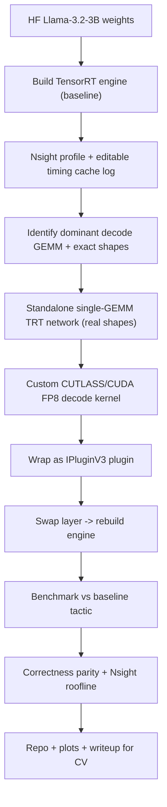

# TensorRT Custom-Tactic Kernel for an LLM on NVIDIA L4

## The one-line CV story

> Built & profiled a TensorRT engine for Llama-3.2-3B on an NVIDIA L4, identified the decode-time MLP GEMM as the compute bottleneck, and replaced TensorRT's auto-selected tactic with a custom CUTLASS FP8 kernel (IPluginV3 plugin), achieving an X% per-token latency reduction at parity accuracy, validated with Nsight Compute.

## The technical thesis (why this is achievable and honest)

Beating cuBLAS/TensorRT on *general* large GEMMs is very hard. But LLM **decode** runs the projections at tiny `M` (batch x 1 token), making them **skinny, memory-bound, GEMV-like** shapes (e.g. `M=1, K=3072, N=8192`). General libraries are tuned for large `M`; specialized decode kernels (FastGEMV / Marlin-style, weight-only or FP8) regularly win here. So the defensible claim is: *"a kernel specialized for the model's exact decode shapes and L4's FP8 tensor cores beats the auto-selected tactic in the low-latency decode regime."* That is the heart of the project.

## Target configuration

- GPU: NVIDIA L4 (Ada Lovelace, SM89), 24 GB, 4th-gen FP8 tensor cores.
- Model: `meta-llama/Llama-3.2-3B-Instruct` (hidden 3072, intermediate 8192, 28 layers). Fallback for fast iteration: `Qwen2.5-1.5B-Instruct`.
- Target GEMM: MLP `gate`/`up` projection (`3072 -> 8192`) and/or `down` (`8192 -> 3072`) at decode (`M`=1..8).
- Stack: TensorRT 10.x, CUTLASS 3.x, CUDA 12.x, Nsight Compute + Nsight Systems, Python + a small C++/CUDA build.

## Key mechanism research (confirmed)

- "Replace a tactic" among *existing* TensorRT kernels = **editable timing cache**: build with `BuilderFlag::kEDITABLE_TIMING_CACHE`, read the per-layer tactic log, then `ITimingCache::update(...)` and rebuild. (`IAlgorithmSelector` is deprecated since TensorRT 10.8.) Use this to learn baseline tactics and prove the concept cheaply.
- Inject your *own* kernel as the selected implementation = **IPluginV3 plugin** that replaces the layer. This is the custom-kernel headline.

## Architecture / data flow

## Two-level strategy (de-risks the win)

1. **Microbenchmark level** (where you clearly win and measure cleanly): a standalone TensorRT network containing a single MatMul of the model's real decode shapes. Compare baseline tactic vs your plugin here. Clean, reproducible numbers.
2. **End-to-end level** (context + credibility): the full model engine with the layer swapped, measuring per-token latency / tokens-per-second delta. Best-effort; the microbenchmark is the rigorous proof.

## Suggested repo layout

- `engine/` - scripts to build baseline + swapped engines (Python TensorRT API or trtexec/ONNX).
- `kernels/` - custom CUDA/CUTLASS GEMM (`.cu`), tuned for decode shapes + FP8.
- `plugin/` - IPluginV3 wrapper (C++), CMake build to a shared lib.
- `bench/` - latency/throughput harness, Nsight scripts, plot generation.
- `eval/` - correctness parity (cosine sim of layer output) + small task eval (e.g. a few hundred prompts).
- `README.md` - results table, plots, how-to-reproduce, honest caveats.

## Risks & honest scoping

- Beating the general tactic at large `M` is unlikely - scope claims to the decode/low-`M` regime.
- FP8 introduces accuracy questions - always report parity (cosine similarity + a small downstream eval), not just speed.
- IPluginV3 + TensorRT-LLM internal fused GEMMs are complex; the standalone-GEMM microbenchmark guarantees a demonstrable result even if full-model swap is fiddly.
- L4 rental cost - keep iteration on the small/fallback model where possible.

## Definition of done (minimum CV-worthy result)

- A reproducible microbenchmark showing the custom plugin beating the auto-selected TensorRT tactic on the real decode shape, with Nsight evidence (higher tensor-core/memory utilization).
- Correctness parity demonstrated.
- A clean repo + README + one benchmark plot + a short writeup/blog.

